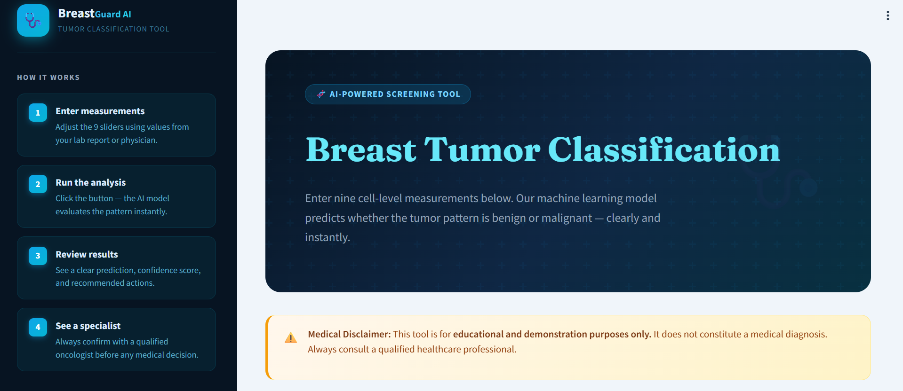
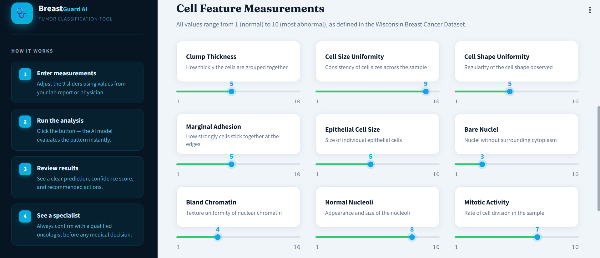
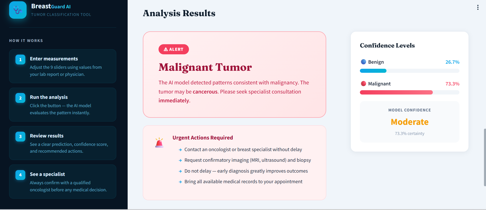
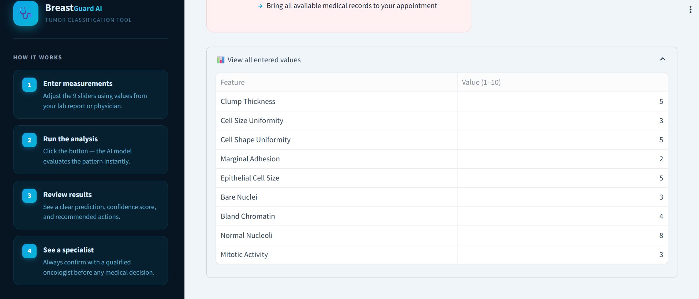

# Breast Cancer Prediction using Machine Learning

## Overview

This project aims to predict whether a breast tumor is **benign (non-cancerous)** or **malignant (cancerous)** using machine learning techniques.  
The models were trained on the **Wisconsin Breast Cancer Dataset**, which contains several cellular characteristics extracted from medical images of breast tissue.

The project follows a complete machine learning workflow including data preprocessing, feature selection, model training, evaluation, and deployment through an interactive web application built with **Streamlit**.

---

## Project Workflow

The project was developed following these main steps:

1. **Data preprocessing**
   - Handling missing values using `SimpleImputer`
   - Feature scaling using `StandardScaler` / `MinMaxScaler`
   - Splitting the dataset into training and testing sets

2. **Feature selection**
   - SelectKBest
   - Chi-Square Test (chi2)
   - ANOVA F-test (f_classif)
   - Mutual Information
   - SelectFromModel

3. **Model training**

   Several machine learning algorithms were implemented and compared.

   **Machine Learning Models**
   - Decision Tree
   - Support Vector Machine (SVM)
   - K-Nearest Neighbors (KNN)
   - Neural Network (MLPClassifier)

   **Ensemble Learning Models**
   - Random Forest
   - AdaBoost

4. **Model evaluation**

   The models were evaluated using multiple metrics to determine the best performing model:
   - Accuracy
   - Precision
   - Recall
   - Confusion Matrix
   - Classification Report

   Cross-validation techniques such as **K-Fold Cross Validation** and **Leave-One-Out validation** were also used to ensure model robustness.

5. **Model optimization**

   Hyperparameters were optimized using **GridSearchCV** to improve the performance of the models.

6. **Deployment**

   The best-performing model was integrated into an interactive web application built with **Streamlit**.  
   The application allows users to enter cellular characteristics and obtain a prediction indicating whether a tumor is likely benign or malignant.

---

## Running the Application

Install dependencies:
## Application Interface

### Main Interface

### choose Features 

### Prediction Result

